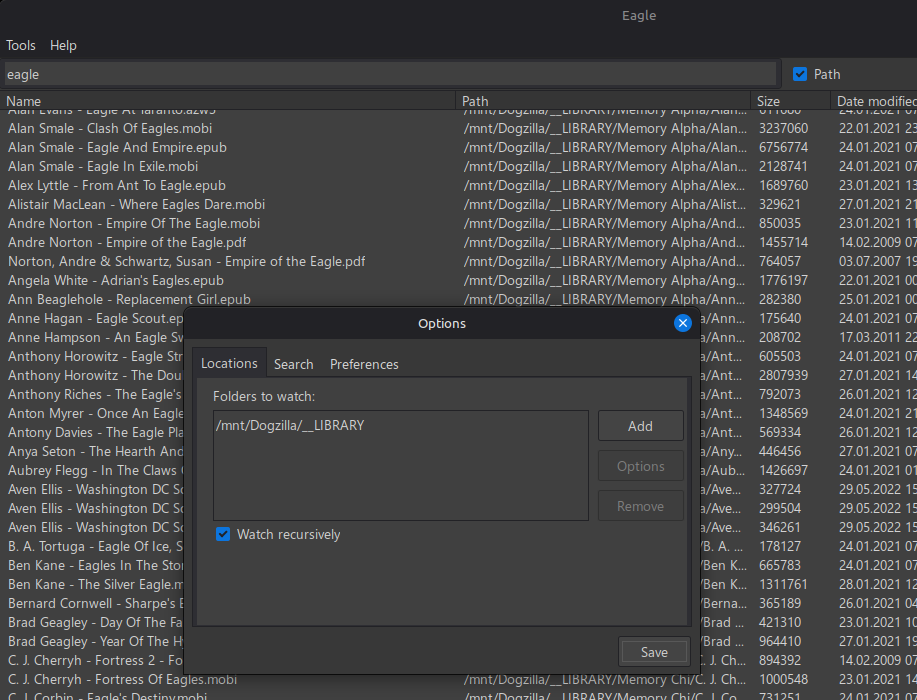

# Eagle
Watch your filesystem like an eagle - [Everything](https://www.voidtools.com/) alternative for Linux.

Eagle is a fast file-search utility that watches file-system changes in real time - for the folders you select.

Obviously inspired by Everything - which I missed since moving to Linux.

## Screenshots

You can see a first scan (around 318k files) and folder-watch [here](./assets/eagle-scan-watch.gif).

## Features

- scans your folders ahead of time, allowing instant search results when you need them
- keeps real-time watch on the folders, so your search results are as accurate as possible
- allows searching in filename and (optionally) in path
- display size and timestamp (can show pretty size and only date)
- context menu to open file/folder, copy name/path
- customizable actions for [Ctrl|Alt|Shift] + Click, double-click & middle-click
- tray icon (can close/minimize/start minimized to tray)
- uses named pipes for IPC (functional, but only used for single-instance right now)
- autorun

## Future plans

- multiple search options
- inter-process communication to allow other programs to get instant search results - in progress
- shortcut to show the search window, where it will allow opening folders/files [not anymore, can set from OS]